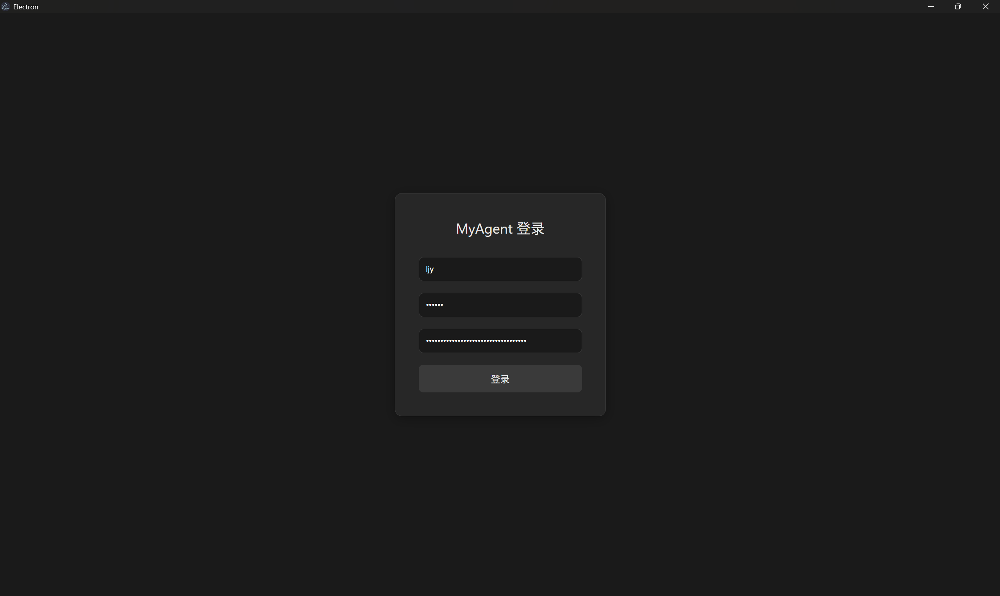
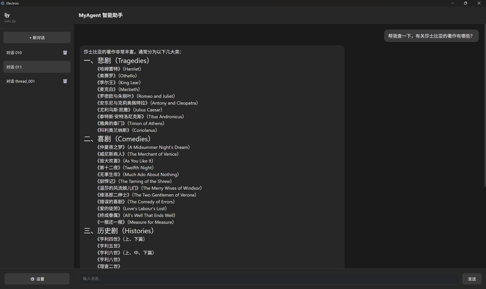
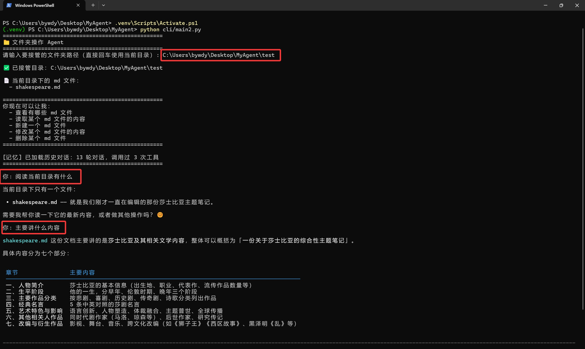

# MyAgent

基于 DeepSeek + LangGraph 的 AI Agent 桌面应用，支持 Web 界面和 CLI 两种模式。

---

## ✨ 功能特性

- 🤖 **AI 对话**：接入 DeepSeek 大模型，支持多轮对话
- 🔧 **工具调用**：自动识别并调用自定义工具（天气查询、文件操作等）
- 💾 **记忆持久化**：对话历史存到 SQLite，下次打开继续聊
- 📁 **文件夹操作**：Agent 接管指定文件夹，对 md 文档进行增删改查
- 📸 **快照备份**：修改文件前自动保存快照，改坏了可以回滚
- 🖥️ **桌面应用**：Electron 打包成 Windows exe，双击就能用

---

## 📸 效果展示

### 桌面端登录


### 桌面端 Chat 模式


### CLI 终端 Work 模式


---

## 🛠️ 技术栈

### 前端
- **Electron** - 桌面应用框架
- **React + TypeScript** - UI 开发
- **Vite** - 构建工具
- **ReactMarkdown** - Markdown 渲染

### 后端
- **Python + FastAPI** - Web API
- **LangChain + LangGraph** - Agent 框架
- **DeepSeek** - 大模型
- **SQLite** - 数据存储

### CLI
- **Rich** - 终端美化输出

---

## 📂 目录结构

```
MyAgent/
├── .venv/                 # Python 虚拟环境
├── backend/              # 后端服务（FastAPI + Agent）
│   ├── api.py            # Web 接口
│   ├── agent.py          # Agent 核心逻辑
│   ├── agent_config.py   # Agent 配置
│   ├── tools_registry.py # 工具自动发现
│   ├── tools/            # 工具集
│   └── requirements.txt  # Python 依赖
│
├── cli/                  # CLI 命令行工具
│   ├── main1.py          # 基础对话测试
│   ├── main2.py          # 文件夹操作 Agent
│   ├── client_config.py   # 客户配置
│   ├── tools/            # 工具集
│   └── requirements.txt  # Python 依赖
│
├── frontend/             # 前端（Electron + React）
│   ├── node_modules/     # npm 依赖包
│   ├── src/              # 源代码
│   ├── package.json     # 前端依赖配置
│   └── electron-builder.yml  # 打包配置
│
├── data/                 # 数据存储（db 文件）
├── docs/                 # 项目文档
├── images/               # 项目图片
└── .env                  # API Key 配置
```

---

## 🚀 快速开始

### 1. 环境准备

```bash
# 创建虚拟环境
python -m venv .venv

# 激活虚拟环境
# Windows:
.venv\Scripts\Activate.ps1
# Mac/Linux:
source .venv/bin/activate

# 安装后端依赖
pip install -r backend/requirements.txt
```

### 2. 配置 API Key

在 `backend/.env` 里填入你的 DeepSeek API Key：
```
DEEPSEEK_API_KEY=sk-xxxxxxxxxxxxxxxx
```

### 3. 启动后端

```bash
cd backend
python api.py
```

### 4. 启动前端

```bash
cd frontend
npm install
npm run dev
```

---

## 📦 打包发布

### 打包后端
```bash
pyinstaller --onefile --name MyAgentServer backend/api.py
```

### 打包前端
```bash
cd frontend
npm run build:win
```

---

## 📝 开发说明

- 后端和 CLI 共用 Agent 逻辑，各自独立运行
- 工具放在 `tools/custom/` 目录下，自动被 Agent 发现
- 数据存在 `data/` 目录下，按用户和会话分文件
- 文件修改快照存在 `.snapshots/` 目录下
